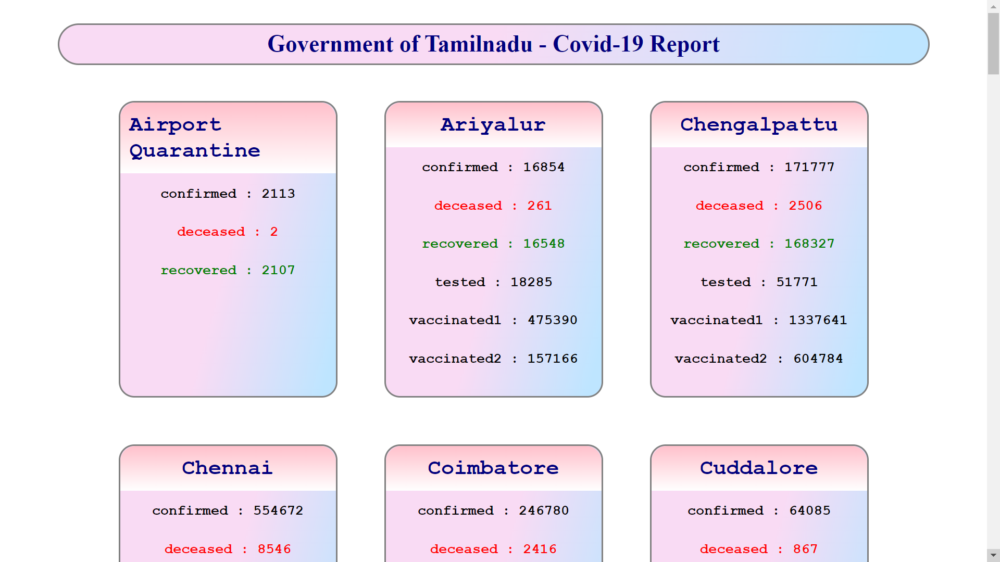

# Day-17 Rest Countries & Weather using fetch API

This project is to create and display the Covid-19 case details of Tamil Nadu by fetching information from the API (https://data.covid19india.org/v4/min/data.min.json).

To view the Covid Details app in browser [Click Here](https://tn-covid-19.netlify.app/)

 

